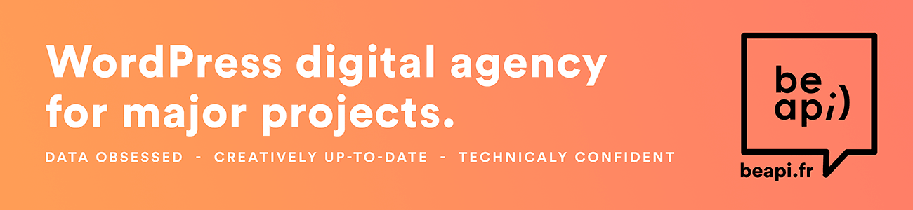

# BEA - Loco Translate Enhancements

Enhancements for Loco Translate.

# What?

This plugin provides 3 targeted enhancements for Loco Translate:

- Include mu-plugins folders in translation sources  
  This specifically targets folder-based mu-plugins, which are commonly loaded through a bootstrap loader such as `mu-require` or `wp-mu-loader`. The plugin extends source discovery so these mu-plugins are correctly exposed to Loco Translate.
- Allow language creation despite `DISALLOW_FILE_MODS`  
  On hardened environments, file modifications can be restricted globally. This plugin keeps language pack creation flows working for the specific Loco Translate context where it is expected and safe.
- Avoid stale Loco Translate plugin cache data  
  Plugin metadata can become outdated in cache after deployments, removals, or structural changes. This plugin clears the Loco plugin cache at the right time to reduce stale entries during automated deployment workflows.

# Requirements

- This plugin works only if the [Loco Translate](https://wordpress.org/plugins/loco-translate/) plugin is installed and activated.
- Tested up to WordPress 7.0.0.
- Tested with Loco Translate 2.8.4.

# Installation

## WordPress

- Download and install using the built-in WordPress plugin installer, or optionally use it as an mu-plugin.
- Activate it from the "Plugins" screen in wp-admin.
- No extra setup is required.

## [Composer](http://composer.rarst.net/)

- Add the repository source: `{ "type": "vcs", "url": "https://github.com/BeAPI/bea-fix-loco-translate" }`.
- Include `"bea/bea-fix-loco-translate": "dev-master"` in your composer file to use the latest branch commits, or use a released tag.
- No extra setup is required.

## Contributing

Please refer to the [contributing guidelines](.github/CONTRIBUTING.md) to increase the chance of your pull request to be merged and/or receive the best support for your issue.

### Issues and feature requests

If you identify an issue or have an idea for improvement, please open an [issue](../../issues/new) or [create a pull request](../../compare) with enough context to help review your request.

# Who?

Created and maintained by [Be API](https://beapi.fr).

This plugin is maintained, but free support is not guaranteed. Please report issues through [GitHub](#issues-and-feature-requests).

If you find this plugin useful, you can support the maintainers with a [donation](https://www.paypal.me/BeAPI).

## License

BEA - Loco Translate Enhancements is licensed under the [GPLv3 or later](LICENSE.md).
